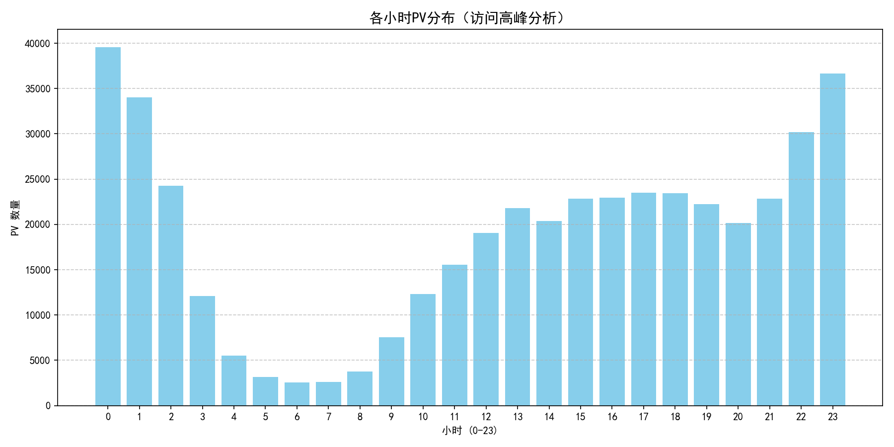
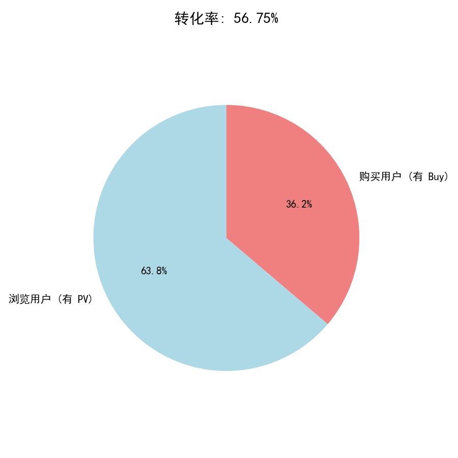
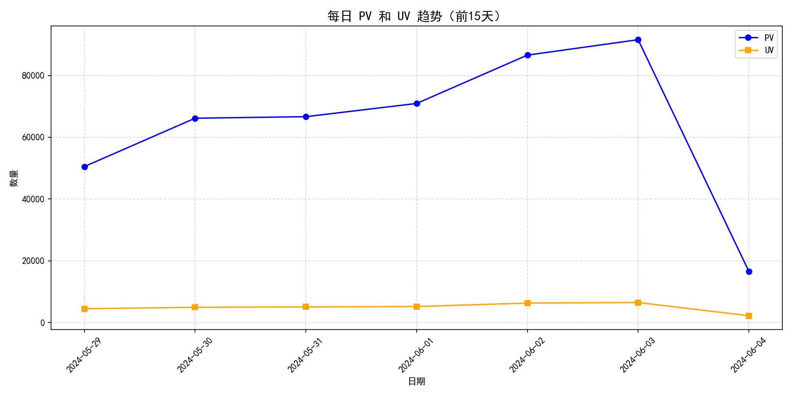

# 电商用户行为数据分析项目

## 项目背景
基于淘宝用户行为数据（50万条记录），使用 Python + SQLite + Matplotlib 进行数据清洗、分析和可视化，挖掘用户行为规律。

## 技术栈
- Python (pandas, sqlite3, matplotlib)
- SQL (复杂查询、窗口函数、聚合分析)
- SQLite 轻量级关系型数据库，用于数据存储与查询

## 分析步骤
1. 数据清洗：处理缺失值、转换时间戳、筛选有效行为（pv/cart/fav/buy）
2. 数据存储：将清洗后的数据存入 SQLite 数据库，构建结构化数据表
3. 核心分析：通过 SQL 查询完成多维度指标计算
   - 每日 PV/UV 趋势分析
   - 每小时 PV 分布（用户访问高峰分析）
   - 用户转化率（浏览→购买）
4. 可视化：使用 Matplotlib 生成柱状图、折线图、漏斗饼图，直观展示分析结果

## 核心结论
1.  **用户访问高峰特征**
    - 高峰时段集中在**23:00和00:00**，单小时PV均超过3.6万次。
    - 早间 5-7 点为流量低谷，PV 不足 3000 次，用户活跃度极低。
    -  整体节奏符合电商用户夜间消费的行为习惯，建议在高峰时段加大运营活动投放。

2.  **用户转化漏斗表现**
    - 平台用户整体转化率为 **36.2%**，即浏览用户中最终完成购买的比例为 36.2%。
    - 未完成购买的浏览用户占比 **63.8%**，存在较大的转化提升空间，后续可针对流失用户进行运营优化。

3.  **每日 PV/UV 趋势特征（前15天）**
    - PV 整体呈波动上升趋势，从初始的约5万次增长至峰值近9万次，平台流量规模持续扩大。
    - UV 整体保持平稳增长，用户基数稳步提升，平台拉新效果良好。
    - 最后一日 PV 出现大幅回落，需结合业务场景进一步排查原因（如数据采集异常、活动结束等）。

## 文件说明
- `clean_data.py` : 数据清洗脚本
- `sql_analysis.py` : SQL 查询脚本
- `visualization.py` : 图表生成脚本
- `cleaned_user_behavior.csv` : 清洗后数据
- `hourly_pv_chart.png` : 小时PV分布图
- `daily_pv_uv_trend.png` : 每日趋势图
- `conversion_pie.png` : 转化率饼图

## 如何运行
1. 安装依赖：`pip install pandas matplotlib`
2. 依次运行三个 Python 脚本：`clean_data.py → sql_analysis.py → visualization.py`

## 分析结果预览

